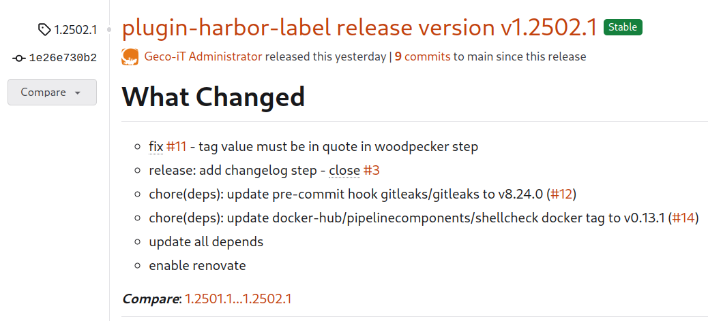

# Woodpecker CI - Git Basic Changelog Plugin

[](https://ci.geco-it.net/repos/woodpecker/plugin-git-basic-changelog)
[](/woodpecker/plugin-git-basic-changelog/issues?state=open)
[](/woodpecker/plugin-git-basic-changelog/pulls?state=open)
[](/woodpecker/plugin-git-basic-changelog/releases)
[](./LICENSE)

> [!WARNING]
> Read-only source code mirror of Geco-iT Open Source projects.

Generate a **CHANGELOG.md** file with all commit logs since the last TAG

- Advanced generator: <https://pawamoy.github.io/git-changelog>

For plugin usage please take a look at [docs.md](./docs.md)

## Build

Build the binary with the following commands:

```bash
# Linux image
$ docker buildx build -t gecoit84/woodpecker-git-basic-changelog-plugin .

# Windows image
$ docker build -f Dockerfile.Windows -t gecoit84/woodpecker-git-basic-changelog-plugin .
```

## Supported architectures

The following architectures are supported by this image:

- linux/amd64
- linux/arm64
- windows/amd64

## License

Released under GPLv3+

## Author Information

This plugin was created by Cyril DUCHENOY, CEO of [Geco-iT SARL](http://www.geco-it.fr).

## Generated changelog example

```bash
$ cat CHANGELOG.md
# What's Changed

- test new woodpecker windows docker run - v0.153
- test new woodpecker windows docker run - v0.152
- test new woodpecker windows docker run - v0.151
...
_**Compare**_: [1.2411.4...1.2411.5](https://...)
```


